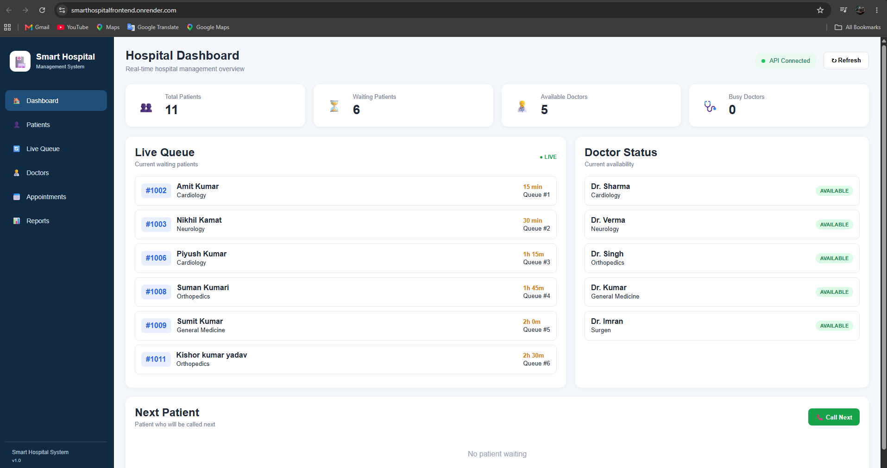
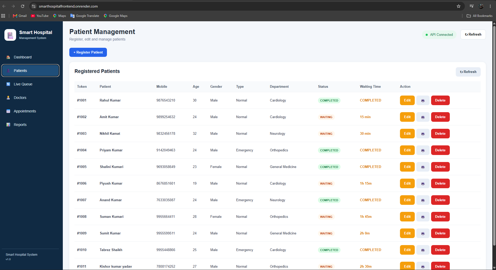
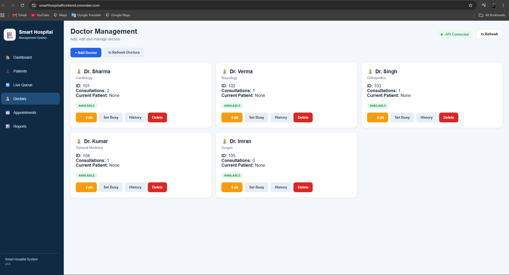
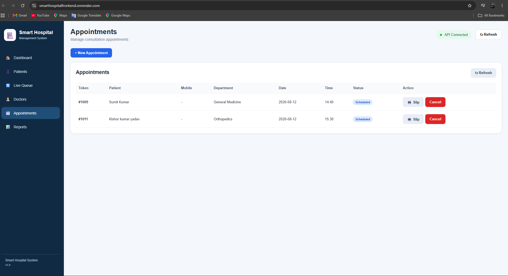
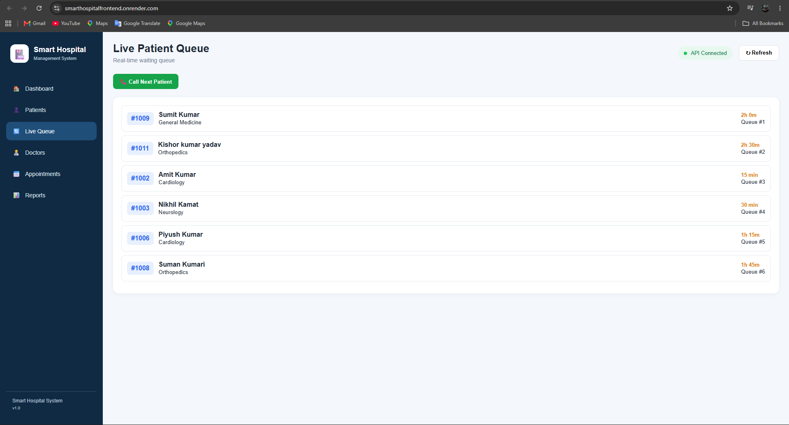
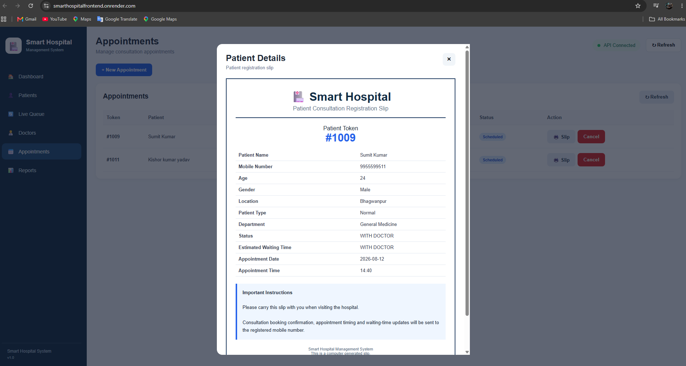
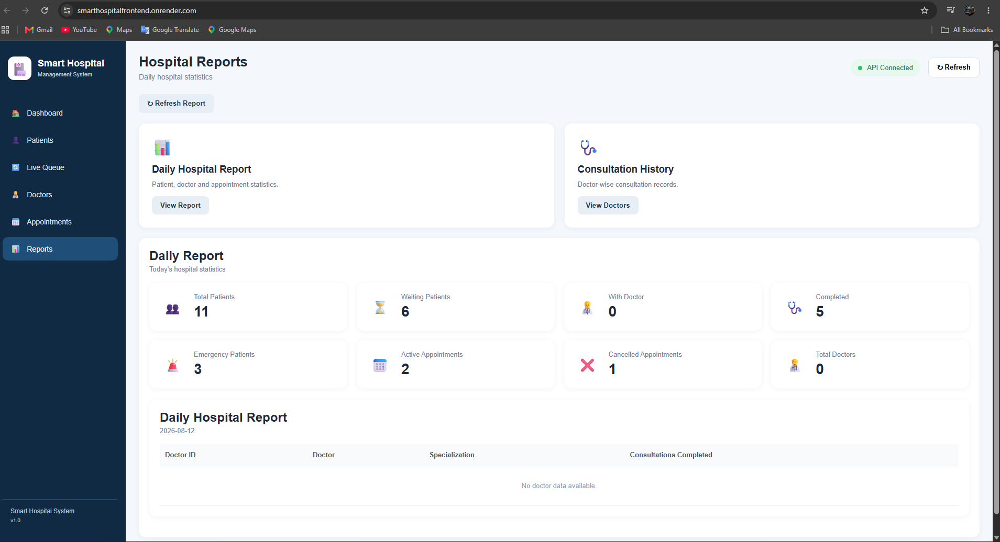

# 🏥 Smart Hospital Management System — Frontend

A web-based frontend for the **Smart Hospital Management System**, developed to provide a simple and user-friendly digital interface for managing common hospital activities such as patients, doctors, appointments, tokens, queues, consultations and reports.

The frontend communicates with a separate **ASP.NET Core Web API** backend and works with a **PostgreSQL** database through the backend services.

---

# 🎯 Main Objective

The main objective of the Smart Hospital Management System is to make hospital operations more organized and improve the overall patient experience through a digital management system.

In a traditional hospital workflow, patients may have to wait without clear information about their token, appointment or expected consultation time. Hospital staff also need to manage patient records, doctors, appointments and waiting queues.

This project brings these activities into a single digital application.

The system is designed to:

- Manage patient information digitally
- Manage doctors and their availability
- Allow patients to book appointments
- Generate and manage patient tokens
- Organize the hospital waiting queue
- Handle priority-based patients
- Display estimated waiting time
- Track consultation status
- Provide hospital dashboard information
- Display reports and statistics
- Connect the frontend with backend REST APIs

The main focus is to improve **patient queue management, appointment handling, hospital data organization and overall patient experience**.

---

# 📌 Project Overview

The Smart Hospital Management System is a full-stack hospital management project developed to digitize common hospital workflows.

This repository contains the **frontend application** of the system.

The frontend provides the user interface through which patients and hospital staff can interact with the hospital management system.

### Main Modules

- Patient Management
- Doctor Management
- Appointment Management
- Token & Queue Management
- Estimated Waiting Time
- Consultation Management
- Dashboard
- Reports
- Appointment Slip

---

# ✨ Key Features

## 👤 Patient Management

The frontend provides interfaces for managing patient information.

- Patient registration
- Patient records
- Patient status
- Patient token information
- Appointment information

---

## 👨‍⚕️ Doctor Management

The doctor section provides information about hospital doctors.

- Doctor list
- Doctor information
- Specialization
- Doctor availability
- Consultation information

---

## 📅 Appointment Management

The appointment module allows users to manage hospital appointments.

- Appointment booking
- Doctor selection
- Appointment date and time
- Appointment status
- Appointment details
- Appointment slip

---

## 🎫 Token & Queue Management

Queue management is one of the important features of the system.

The frontend provides:

- Patient token information
- Waiting queue
- Priority-based patient handling
- Next patient information
- Patient queue status
- Consultation status

---

## ⏱️ Estimated Waiting Time

The system provides estimated waiting-time information to help patients understand their expected consultation turn.

This helps improve:

- Queue transparency
- Patient experience
- Waiting-time management
- Hospital workflow

---

## 🩺 Consultation Management

The system provides consultation-related information and helps maintain the workflow between doctors and patients.

Consultation information can also be used for maintaining consultation history and generating reports.

---

## 📊 Dashboard

The dashboard provides an overview of important hospital activities and statistics.

It can display information related to:

- Total patients
- Doctors
- Appointments
- Waiting queue
- Consultations
- Hospital activities

---

## 📈 Reports

The reports section provides hospital-related information and statistics.

Reports include information related to:

- Patients
- Doctors
- Appointments
- Consultations
- Hospital activities

---

# 📸 Application Screenshots

The following screenshots demonstrate the main features and user interface of the Smart Hospital Management System.

## 🏠 Dashboard



---

## 👤 Patient Management



---

## 👨‍⚕️ Doctor Management



---

## 📅 Appointment Booking



---

## 🎫 Queue & Token Management



---

## 📄 Appointment Slip



---

## 📊 Reports



---

# 🏗️ System Architecture

```text
                  Smart Hospital Frontend
                HTML + CSS + JavaScript
                          │
                          │ REST API
                          ▼
                ASP.NET Core Web API
                          │
                          │ Database Operations
                          ▼
                     PostgreSQL
```

The frontend communicates with the ASP.NET Core Web API through REST API requests.

The backend handles application logic and database operations, while PostgreSQL provides persistent data storage.

---

# 🛠️ Technology Stack

## Frontend

- **HTML5**
- **CSS3**
- **JavaScript**

## Backend Integration

- **C#**
- **ASP.NET Core Web API**
- **REST APIs**

## Database

- **PostgreSQL**

## Tools & Deployment

- **Git**
- **GitHub**
- **Render**

---

# 📂 Frontend Project Structure

```text
SmartHospitalFrontend/
│
├── css/
│   └── style.css
│
├── js/
│   └── app.js
│
├── appointment-booking.png
├── appointment-slip.png
├── dashboard.png
├── doctors.png
├── patients.png
├── queue.png
├── reports.png
│
├── index.html
└── README.md
```

---

# 🔌 Backend API Integration

The frontend communicates with the Smart Hospital backend through REST APIs.

### Backend Repository

[SmartHospitalAPI](https://github.com/kumarpriyam/SmartHospitalAPI)

### Live Backend API

[Smart Hospital API](https://smarthospitalapi.onrender.com)

The frontend uses backend APIs to retrieve and manage hospital data.

```text
Frontend
   │
   │ GET / POST / PUT / DELETE
   ▼
ASP.NET Core Web API
   │
   ▼
PostgreSQL
```

---

# 🚀 Deployment

The frontend application is deployed using **Render**.

### 🌐 Live Application

[Smart Hospital Management System](https://smarthospitalfrontend.onrender.com)

The deployed frontend communicates with the online ASP.NET Core backend API.

---

# ⚙️ Local Setup

## Prerequisites

Make sure the following are available:

- Web Browser
- Git
- VS Code
- Backend API running locally or online

---

## 1. Clone the Repository

```bash
git clone https://github.com/kumarpriyam/SmartHospitalFrontend.git
```

Move into the project directory:

```bash
cd SmartHospitalFrontend
```

---

## 2. Run the Frontend

Open the project in VS Code.

You can open `index.html` directly in a browser or use **VS Code Live Server** for local development.

---

# 🔄 Application Flow

```text
Patient / Hospital Staff
          │
          ▼
Smart Hospital Frontend
          │
          │ REST API
          ▼
ASP.NET Core Backend
          │
          ▼
PostgreSQL Database
```

---

# 📚 What I Learned

This project helped me gain practical experience in frontend development and full-stack application integration.

Through this project, I worked with:

- **HTML5**
- **CSS3**
- **JavaScript**
- **REST API integration**
- **Frontend-backend communication**
- **Dynamic web interfaces**
- **Hospital workflow design**
- **API-based data handling**
- **Git and GitHub**
- **Cloud deployment using Render**

The project also helped me understand how a frontend application communicates with a backend API and database to create a complete full-stack application.

---

# 🔮 Future Improvements

Possible future improvements include:

- Real-time queue updates
- SMS notifications for patients
- Email notifications
- Improved responsive design
- Advanced authentication
- Role-based dashboards
- Better mobile experience
- Improved accessibility
- Progressive Web App support
- Advanced security and validation

These improvements can make the application more scalable, secure and suitable for larger hospital environments.

---

# 👨‍💻 Author

## Priyam Kumar

**MCA | Data Analytics & Engineering | Software Development**

I enjoy building practical software solutions and using technology to solve real-world problems.

### Contact

📧 **Email:**  
kumarpriyam1414@gmail.com

🔗 **LinkedIn:**  
[linkedin.com/in/priyamkumar01](https://linkedin.com/in/priyamkumar01)

🐙 **GitHub:**  
[github.com/kumarpriyam](https://github.com/kumarpriyam)

---

# 🔗 Project Links

### Frontend Repository

[SmartHospitalFrontend](https://github.com/kumarpriyam/SmartHospitalFrontend)

### Backend Repository

[SmartHospitalAPI](https://github.com/kumarpriyam/SmartHospitalAPI)

### Live Application

[Smart Hospital Frontend](https://smarthospitalfrontend.onrender.com)

### Backend API

[Smart Hospital API](https://smarthospitalapi.onrender.com)

---

# ⭐ Project

If you find this project useful or interesting, feel free to explore the complete Smart Hospital Management System.

Feedback, suggestions and collaboration are always welcome.

---

# 📄 License

This project is created for **educational, learning and portfolio purposes**.
